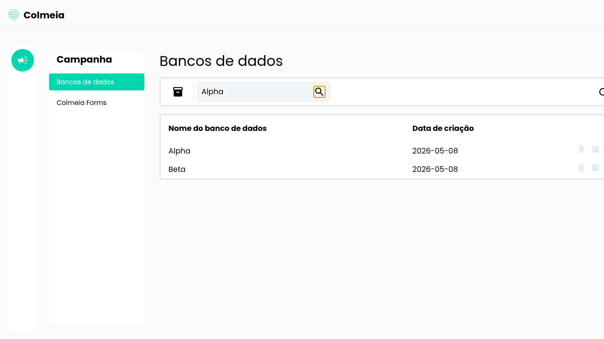
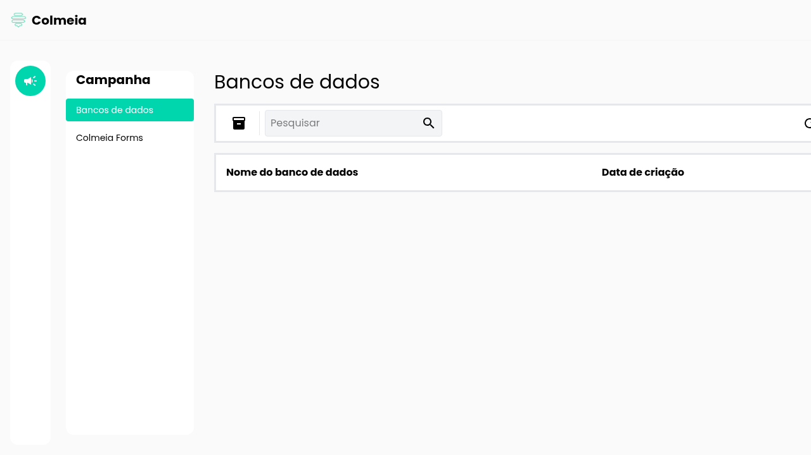
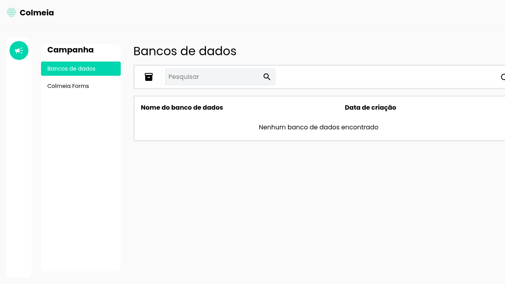
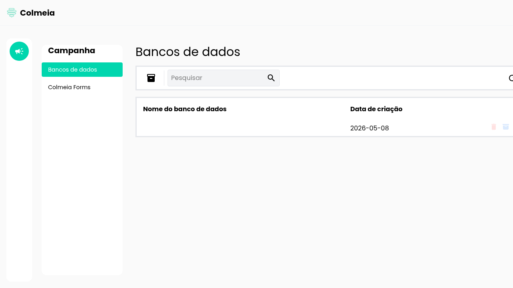
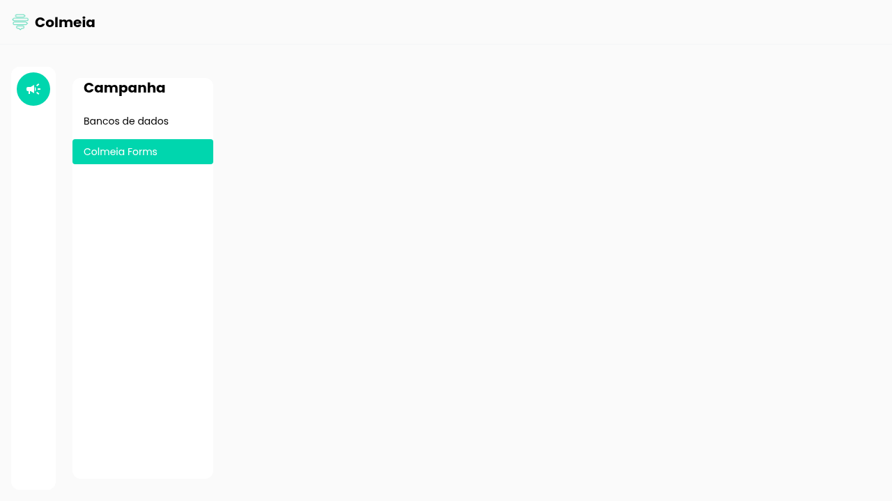
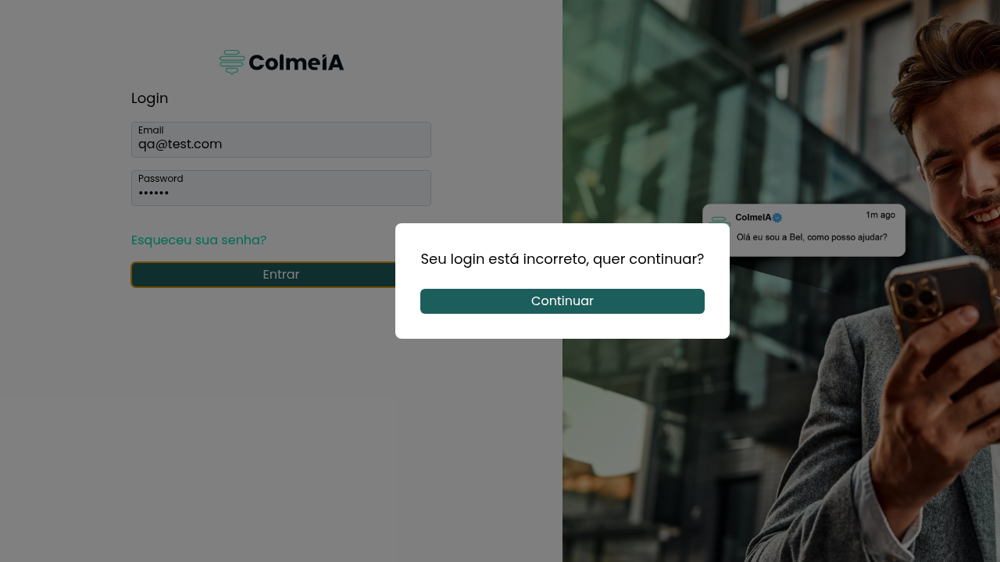
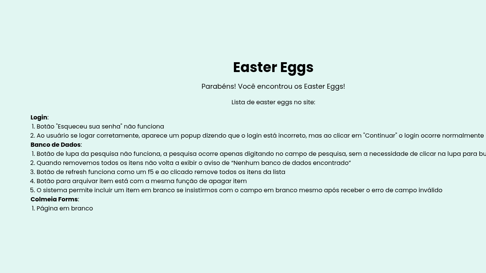

# Suíte Cypress - Colmeia QA

Suíte criada com base nos insumos iniciais do desafio e na exploração controlada do alvo real `https://teste-colmeia-qa.colmeia-corp.com/`.

## Testes principais derivados da página Easter Eggs

A página `/easter-eggs` foi tratada como a principal fonte de cenários da entrega. Ela expõe publicamente uma lista interna de defeitos, então a estratégia adotada foi:

1. validar a própria página `easter-eggs` como fonte de pistas
2. transformar cada item listado nela em um cenário automatizado de regressão
3. separar esses cenários dos demais testes feitos fora dessa lista

Arquivos principais:

- [cypress/e2e/regression/easter-eggs-derived.cy.js](/home/sm7f/Project/Portifolio/Portifolio-Agente/Projetos/qa-test/cypress/e2e/regression/easter-eggs-derived.cy.js:1)
- [cypress/e2e/regression/easter-eggs.cy.js](/home/sm7f/Project/Portifolio/Portifolio-Agente/Projetos/qa-test/cypress/e2e/regression/easter-eggs.cy.js:1)
- [cypress/e2e/evidence/easter-eggs-derived-evidence.cy.js](/home/sm7f/Project/Portifolio/Portifolio-Agente/Projetos/qa-test/cypress/e2e/evidence/easter-eggs-derived-evidence.cy.js:1)

Comandos:

```bash
npm run test:easter-eggs-derived
npm run test:easter-eggs-derived-evidence
npm run test:easter-eggs
```

Resultado executado:

- `test:easter-eggs-derived`: `0/8` passando e `8/8` falhando como evidência direta dos defeitos listados na página
- `test:easter-eggs-derived-evidence`: `8/8` passando e `8` screenshots gerados em `docs/evidencias/easter-eggs-derived-evidence.cy.js/`
- `test:easter-eggs`: `3/3` passando e `2` screenshots gerados em `docs/evidencias/easter-eggs.cy.js/`

Cobertura principal derivada do Easter Eggs:

- `Login`: `Esqueceu sua senha?` deveria ser navegável ou acionável
- `Login`: login válido não deveria mostrar modal contraditório
- `Banco de Dados`: a lupa deveria executar a busca
- `Banco de Dados`: o estado vazio deveria reaparecer após excluir todos os itens
- `Banco de Dados`: o refresh não deveria apagar a lista
- `Banco de Dados`: arquivar deveria ser diferente de apagar
- `Banco de Dados`: item em branco não deveria ser persistido
- `Colmeia Forms`: a rota deveria renderizar conteúdo funcional

Prints de evidência dos cenários principais:

### EE-DR-01 Login - `Esqueceu sua senha?`

- Achado: o link está visível, mas sem ação útil e sem `href`
- Script de evidência: [cypress/e2e/evidence/easter-eggs-derived-evidence.cy.js](/home/sm7f/Project/Portifolio/Portifolio-Agente/Projetos/qa-test/cypress/e2e/evidence/easter-eggs-derived-evidence.cy.js:14)
- Screenshot: [login-esqueceu-senha-sem-acao.png](./docs/evidencias/easter-eggs-derived-evidence.cy.js/login-esqueceu-senha-sem-acao.png)


### EE-DR-02 Login - modal contraditório

- Achado: login válido exibe `Seu login está incorreto, quer continuar?`
- Script de evidência: [cypress/e2e/evidence/easter-eggs-derived-evidence.cy.js](/home/sm7f/Project/Portifolio/Portifolio-Agente/Projetos/qa-test/cypress/e2e/evidence/easter-eggs-derived-evidence.cy.js:22)
- Screenshot: [login-valido-modal-contraditorio-easter-eggs.png](./docs/evidencias/easter-eggs-derived-evidence.cy.js/login-valido-modal-contraditorio-easter-eggs.png)


### EE-DR-03 Banco de Dados - lupa sem efeito

- Achado: clicar na lupa não filtra a lista; os itens `Alpha` e `Beta` permanecem visíveis
- Script de evidência: [cypress/e2e/evidence/easter-eggs-derived-evidence.cy.js](/home/sm7f/Project/Portifolio/Portifolio-Agente/Projetos/qa-test/cypress/e2e/evidence/easter-eggs-derived-evidence.cy.js:31)
- Screenshot: [bancos-lupa-nao-filtra.png](./docs/evidencias/easter-eggs-derived-evidence.cy.js/bancos-lupa-nao-filtra.png)



### EE-DR-04 Banco de Dados - estado vazio não retorna

- Achado: após excluir o único item, a mensagem `Nenhum banco de dados encontrado` não reaparece
- Script de evidência: [cypress/e2e/evidence/easter-eggs-derived-evidence.cy.js](/home/sm7f/Project/Portifolio/Portifolio-Agente/Projetos/qa-test/cypress/e2e/evidence/easter-eggs-derived-evidence.cy.js:42)
- Screenshot: [bancos-estado-vazio-nao-retorna.png](./docs/evidencias/easter-eggs-derived-evidence.cy.js/bancos-estado-vazio-nao-retorna.png)



### EE-DR-05 Banco de Dados - refresh apaga a lista

- Achado: o botão de refresh descarta o item recém-criado em vez de apenas recarregar a visão
- Script de evidência: [cypress/e2e/evidence/easter-eggs-derived-evidence.cy.js](/home/sm7f/Project/Portifolio/Portifolio-Agente/Projetos/qa-test/cypress/e2e/evidence/easter-eggs-derived-evidence.cy.js:52)
- Screenshot: [bancos-refresh-apaga-lista.png](./docs/evidencias/easter-eggs-derived-evidence.cy.js/bancos-refresh-apaga-lista.png)



### EE-DR-06 Banco de Dados - arquivar age como apagar

- Achado: ao arquivar, o item some da listagem e não há estado visível de item arquivado
- Script de evidência: [cypress/e2e/evidence/easter-eggs-derived-evidence.cy.js](/home/sm7f/Project/Portifolio/Portifolio-Agente/Projetos/qa-test/cypress/e2e/evidence/easter-eggs-derived-evidence.cy.js:61)
- Screenshot: [bancos-arquivar-age-como-apagar.png](./docs/evidencias/easter-eggs-derived-evidence.cy.js/bancos-arquivar-age-como-apagar.png)


### EE-DR-07 Banco de Dados - item em branco persistido

- Achado: após insistir no `Salvar`, o sistema persiste uma linha vazia mesmo depois de validar erro obrigatório
- Script de evidência: [cypress/e2e/evidence/easter-eggs-derived-evidence.cy.js](/home/sm7f/Project/Portifolio/Portifolio-Agente/Projetos/qa-test/cypress/e2e/evidence/easter-eggs-derived-evidence.cy.js:72)
- Screenshot: [bancos-item-em-branco-persistido.png](./docs/evidencias/easter-eggs-derived-evidence.cy.js/bancos-item-em-branco-persistido.png)



### EE-DR-08 Colmeia Forms - página em branco

- Achado: a rota abre, mas o `ng-component` principal permanece sem conteúdo útil
- Script de evidência: [cypress/e2e/evidence/easter-eggs-derived-evidence.cy.js](/home/sm7f/Project/Portifolio/Portifolio-Agente/Projetos/qa-test/cypress/e2e/evidence/easter-eggs-derived-evidence.cy.js:82)
- Screenshot: [colmeia-forms-pagina-em-branco.png](./docs/evidencias/easter-eggs-derived-evidence.cy.js/colmeia-forms-pagina-em-branco.png)



Cobertura da página fonte:

- valida que a rota `/easter-eggs` é pública e responde sem redirecionamento
- valida título, mensagem introdutória e texto de contexto
- valida as categorias `Login`, `Banco de Dados` e `Colmeia Forms`
- valida a contagem de itens por categoria: `2`, `5` e `1`
- valida os textos de defeitos exibidos na página

Evidências vinculadas:

- origem das pistas: [cypress/e2e/regression/easter-eggs.cy.js](/home/sm7f/Project/Portifolio/Portifolio-Agente/Projetos/qa-test/cypress/e2e/regression/easter-eggs.cy.js:1)
- cenários derivados: [cypress/e2e/regression/easter-eggs-derived.cy.js](/home/sm7f/Project/Portifolio/Portifolio-Agente/Projetos/qa-test/cypress/e2e/regression/easter-eggs-derived.cy.js:1)
- capturas curadas dos cenários principais: [cypress/e2e/evidence/easter-eggs-derived-evidence.cy.js](/home/sm7f/Project/Portifolio/Portifolio-Agente/Projetos/qa-test/cypress/e2e/evidence/easter-eggs-derived-evidence.cy.js:1)
- script da página pública: [cypress/e2e/regression/easter-eggs.cy.js](/home/sm7f/Project/Portifolio/Portifolio-Agente/Projetos/qa-test/cypress/e2e/regression/easter-eggs.cy.js:22)
- screenshot da página pública: [easter-eggs-pagina-publica.png](./docs/evidencias/easter-eggs.cy.js/easter-eggs-pagina-publica.png)
- script das categorias e contagens: [cypress/e2e/regression/easter-eggs.cy.js](/home/sm7f/Project/Portifolio/Portifolio-Agente/Projetos/qa-test/cypress/e2e/regression/easter-eggs.cy.js:30)
- screenshot das categorias e contagens: [easter-eggs-categorias-e-contagens.png](./docs/evidencias/easter-eggs.cy.js/easter-eggs-categorias-e-contagens.png)
- screenshots automáticos das falhas derivadas: `cypress/screenshots/easter-eggs-derived.cy.js/`


## Outros testes separados

Além da trilha principal derivada do Easter Eggs, a suíte mantém trilhas separadas para:

- integração do fluxo de login e roteamento
- regressão crítica dos fluxos que continuam funcionais
- defeitos complementares fora da lista do Easter Eggs
- evidências visuais curadas para achados importantes

## Resumo da entrega

O trabalho cobre:

- mapeamento técnico do alvo real
- verificação de segurança do fluxo de login e autenticação
- transformação da página Easter Eggs em suíte principal de regressão
- implementação de suítes complementares separadas
- documentação objetiva dos achados e das evidências

O alvo inspecionado é um front Angular `21.1.3`, servido como site estático. As rotas identificadas foram:

- `/`
- `/dashboard`
- `/dashboard/campanha/bancos-de-dados`
- `/dashboard/campanha/colmeia-forms`
- `/easter-eggs`

## Achados principais

Falhas reais identificadas no comportamento do site:

1. o link `Esqueceu sua senha?` não possui ação útil
2. login válido abre um modal com mensagem contraditória: `Seu login está incorreto, quer continuar?`
3. o botão de lupa da pesquisa não executa busca por clique
4. ao remover todos os itens, a mensagem `Nenhum banco de dados encontrado` não reaparece
5. o botão de refresh age como um `F5` e descarta a lista
6. o botão de arquivar chama a mesma ação do botão de apagar
7. item em branco pode ser criado depois de insistir no submit inválido
8. a rota `Colmeia Forms` renderiza conteúdo vazio
9. a autenticação ocorre no cliente, com credenciais expostas no bundle
10. usuário não autenticado consegue acessar `/dashboard/campanha/bancos-de-dados`
11. a rota `/easter-eggs` exposta publicamente lista bugs da aplicação

## Segurança de login e autenticação

Os principais achados de segurança do fluxo de autenticação foram:

- o bundle `main-OLCR3OTF.js` contém a comparação direta `qa@test.com` + `123456` no `onSubmit()`
- após o login considerado válido pelo front, o fluxo apenas abre um modal e navega para `/dashboard`
- não foi encontrada evidência de API de autenticação, criação de sessão, token ou cookie de login no caminho analisado
- `curl -I -L` para a rota de dashboard retornou a página estática protegida sem qualquer bloqueio de acesso
- o teste [cypress/e2e/integration/auth-state.cy.js](/home/sm7f/Project/Portifolio/Portifolio-Agente/Projetos/qa-test/cypress/e2e/integration/auth-state.cy.js:1) confirmou abertura direta do dashboard sem autenticação

Em termos práticos, o sistema atual não implementa autenticação real. O “login” é apenas uma validação client-side com navegação local.

Recomendações imediatas:

- mover a autenticação para o backend
- remover credenciais hardcoded do front
- emitir sessão real com controles `HttpOnly`, `Secure` e `SameSite`
- proteger rotas privadas com validação no servidor, não apenas no roteador do front
- retornar `401` ou `403` para recursos privados quando não houver sessão válida
- revisar a política de headers de segurança da entrega pública

## Estrutura entregue

```txt
cypress/
  component/
    README.md
  e2e/
    evidence/
      easter-eggs-derived-evidence.cy.js
      important-evidence.cy.js
    integration/
      auth-state.cy.js
    regression/
      easter-eggs.cy.js
      easter-eggs-derived.cy.js
      critical-flows.cy.js
      known-defects.cy.js
  fixtures/
    site-profile.json
    users.json
  support/
    commands.js
    e2e.js
docs/
  evidencias/
    easter-eggs.cy.js/
      easter-eggs-pagina-publica.png
      easter-eggs-categorias-e-contagens.png
    easter-eggs-derived-evidence.cy.js/
      login-esqueceu-senha-sem-acao.png
      login-valido-modal-contraditorio-easter-eggs.png
      bancos-lupa-nao-filtra.png
      bancos-estado-vazio-nao-retorna.png
      bancos-refresh-apaga-lista.png
      bancos-arquivar-age-como-apagar.png
      bancos-item-em-branco-persistido.png
      colmeia-forms-pagina-em-branco.png
    important-evidence.cy.js/
      dashboard-sem-autenticacao.png
      login-valido-modal-contraditorio.png
      rota-publica-easter-eggs.png
      item-em-branco-persistido.png
  estrategia-e-cenarios.md
```

## Automação e organização

- [scripts/cypress-local.sh](/home/sm7f/Project/Portifolio/Portifolio-Agente/Projetos/qa-test/scripts/cypress-local.sh:1) prepara o runtime e corrige a execução do Cypress
- [cypress/support/commands.js](/home/sm7f/Project/Portifolio/Portifolio-Agente/Projetos/qa-test/cypress/support/commands.js:1) centraliza comandos reutilizáveis
- [cypress/fixtures/users.json](/home/sm7f/Project/Portifolio/Portifolio-Agente/Projetos/qa-test/cypress/fixtures/users.json:1) isola a massa de teste
- [cypress/fixtures/site-profile.json](/home/sm7f/Project/Portifolio/Portifolio-Agente/Projetos/qa-test/cypress/fixtures/site-profile.json:1) isola rotas, seletores e textos de apoio
- `regression/easter-eggs-derived` é a trilha principal dos defeitos
- `regression/easter-eggs` valida a página que originou os cenários
- `evidence/easter-eggs-derived-evidence` gera prints dedicados para os oito cenários principais derivados do Easter Eggs
- `integration/` cobre formulário, estado e roteamento do front
- `regression/critical-flows` cobre o comportamento que hoje permanece funcional
- `regression/known-defects` ficou separado para achados complementares fora da lista do Easter Eggs
- `evidence/important-evidence` concentra capturas complementares para os achados mais sensíveis

## Suítes implementadas

### Easter Eggs - cenários derivados principais

Arquivo: [cypress/e2e/regression/easter-eggs-derived.cy.js](/home/sm7f/Project/Portifolio/Portifolio-Agente/Projetos/qa-test/cypress/e2e/regression/easter-eggs-derived.cy.js:1)

- `Login`: `Esqueceu sua senha?` deveria ter ação útil
- `Login`: login válido não deveria mostrar mensagem contraditória
- `Banco de Dados`: a lupa deveria executar a busca
- `Banco de Dados`: o estado vazio deveria reaparecer após excluir todos os itens
- `Banco de Dados`: o refresh não deveria apagar a lista
- `Banco de Dados`: arquivar não deveria excluir
- `Banco de Dados`: item em branco não deveria ser persistido
- `Colmeia Forms`: a página não deveria ficar em branco

### Easter Eggs - origem das pistas

Arquivo: [cypress/e2e/regression/easter-eggs.cy.js](/home/sm7f/Project/Portifolio/Portifolio-Agente/Projetos/qa-test/cypress/e2e/regression/easter-eggs.cy.js:1)

- valida acesso público direto à rota `/easter-eggs`
- valida o conteúdo introdutório da página
- valida as categorias `Login`, `Banco de Dados` e `Colmeia Forms`
- valida as quantidades `2`, `5` e `1` para os itens listados
- valida os textos dos defeitos exibidos na página

### Integração

Arquivo: [cypress/e2e/integration/auth-state.cy.js](/home/sm7f/Project/Portifolio/Portifolio-Agente/Projetos/qa-test/cypress/e2e/integration/auth-state.cy.js:1)

- validação de erro no login inválido
- login válido com transição para dashboard via modal
- acesso direto ao dashboard sem autenticação

### Regressão crítica

Arquivo: [cypress/e2e/regression/critical-flows.cy.js](/home/sm7f/Project/Portifolio/Portifolio-Agente/Projetos/qa-test/cypress/e2e/regression/critical-flows.cy.js:1)

- carga da tela de login
- login válido até o dashboard
- abertura da área de bancos de dados
- acesso direto à página de easter eggs

### Defeitos complementares fora do Easter Eggs

Arquivo: [cypress/e2e/regression/known-defects.cy.js](/home/sm7f/Project/Portifolio/Portifolio-Agente/Projetos/qa-test/cypress/e2e/regression/known-defects.cy.js:1)

- dashboard não deveria abrir sem autenticação
- a página interna `/easter-eggs` não deveria ficar pública

### Evidências visuais curadas

Arquivo principal: [cypress/e2e/evidence/easter-eggs-derived-evidence.cy.js](/home/sm7f/Project/Portifolio/Portifolio-Agente/Projetos/qa-test/cypress/e2e/evidence/easter-eggs-derived-evidence.cy.js:1)

- gera capturas consistentes dos oito cenários principais derivados da página Easter Eggs
- saída em `docs/evidencias/easter-eggs-derived-evidence.cy.js/`

Arquivo complementar: [cypress/e2e/evidence/important-evidence.cy.js](/home/sm7f/Project/Portifolio/Portifolio-Agente/Projetos/qa-test/cypress/e2e/evidence/important-evidence.cy.js:1)

- gera capturas complementares para login contraditório, dashboard sem autenticação, Easter Eggs pública e persistência de item vazio

## Alvo testado

```txt
https://teste-colmeia-qa.colmeia-corp.com/
```

## Linhas de execução usadas

```bash
./scripts/cypress-local.sh verify
./scripts/cypress-local.sh run --config screenshotsFolder=docs/evidencias,trashAssetsBeforeRuns=false --spec 'cypress/e2e/regression/easter-eggs.cy.js'
./scripts/cypress-local.sh run --spec 'cypress/e2e/regression/easter-eggs-derived.cy.js'
./scripts/cypress-local.sh run --config screenshotsFolder=docs/evidencias,trashAssetsBeforeRuns=false --spec 'cypress/e2e/evidence/easter-eggs-derived-evidence.cy.js'
./scripts/cypress-local.sh run --config screenshotsFolder=docs/evidencias,trashAssetsBeforeRuns=false --spec 'cypress/e2e/evidence/important-evidence.cy.js'
./scripts/cypress-local.sh run --spec 'cypress/e2e/integration/**/*.cy.js'
./scripts/cypress-local.sh run --spec 'cypress/e2e/regression/critical-flows.cy.js,cypress/e2e/regression/easter-eggs.cy.js'
./scripts/cypress-local.sh run --spec 'cypress/e2e/regression/known-defects.cy.js'
```

Verificação de segurança do login e da autenticação:

```bash
curl -I -L https://teste-colmeia-qa.colmeia-corp.com/
curl -I -L https://teste-colmeia-qa.colmeia-corp.com/dashboard/campanha/bancos-de-dados
curl -L https://teste-colmeia-qa.colmeia-corp.com/main-OLCR3OTF.js -o /tmp/colmeia-main.js
rg -n "qa@test.com|123456|router.navigate|createAccHandler" /tmp/colmeia-main.js
./scripts/cypress-local.sh run --spec 'cypress/e2e/integration/auth-state.cy.js'
```

## Instalar e executar

Foi preparado um runtime local de Node no próprio diretório para viabilizar a instalação do Cypress neste ambiente.

```bash
export PATH="$PWD/.tools/node-v24.14.1-linux-x64/bin:$PATH"
npm install
npx cypress open
npm run test:easter-eggs
npm run test:easter-eggs-derived
npm run test:easter-eggs-derived-evidence
npm run test:evidence
npm run test:integration
npm run test:regression
npm run test:defects
```

## Resultado da execução neste ambiente

- `npm install`: executado com sucesso
- `./scripts/cypress-local.sh verify`: executado com sucesso
- `test:easter-eggs`: `3/3` passando e `2` screenshots gerados em `docs/evidencias/easter-eggs.cy.js/`
- `test:easter-eggs-derived`: `0/8` passando e `8/8` falhando como evidência dos defeitos listados na página
- `test:easter-eggs-derived-evidence`: `8/8` passando e `8` screenshots gerados em `docs/evidencias/easter-eggs-derived-evidence.cy.js/`
- `test:evidence`: `4/4` passando e `4` screenshots gerados em `docs/evidencias/`
- `./scripts/cypress-local.sh run --spec 'cypress/e2e/integration/auth-state.cy.js'`: `3/3` passando
- `test:regression`: `7/7` passando
- `test:defects`: `0/2` passando e `2/2` falhando para os achados complementares fora do Easter Eggs

Resumo de esperado vs. obtido:

- esperado: `Esqueceu sua senha?` deveria acionar recuperação; obtido: o link não tem `href`
- esperado: login válido deveria concluir sem erro; obtido: modal contraditório apareceu
- esperado: a lupa deveria executar a busca; obtido: a lista não filtrou por clique
- esperado: a lista vazia deveria reaparecer; obtido: a mensagem não voltou
- esperado: o refresh não deveria descartar a lista; obtido: os itens sumiram
- esperado: arquivar deveria preservar o item; obtido: o estado arquivado não apareceu
- esperado: item em branco deveria ser bloqueado; obtido: a linha vazia foi persistida
- esperado: `Colmeia Forms` deveria renderizar conteúdo; obtido: o componente ficou vazio
- esperado: autenticação validada no servidor; obtido: comparação local de credenciais no bundle
- esperado: rota privada exigir autenticação; obtido: dashboard abriu sem login
- esperado: página interna de bugs não deveria ser pública; obtido: `/easter-eggs` abriu diretamente

## Evidências técnicas usadas

- HTML inicial do alvo, que expõe os seletores reais de login
- bundle `main-OLCR3OTF.js`, que expõe rotas, validações e handlers
- headers HTTP, que mostram hospedagem estática
- ausência de `robots.txt` e `sitemap.xml`
- screenshots dedicados dos oito cenários principais em `docs/evidencias/easter-eggs-derived-evidence.cy.js/`
- screenshots curados em `docs/evidencias/`, vinculados a script e achado
- screenshots automáticos das falhas derivadas em `cypress/screenshots/easter-eggs-derived.cy.js/`
- screenshots de falha geradas em `cypress/screenshots/known-defects.cy.js/`

## Evidências visuais curadas

As capturas abaixo foram geradas pelo spec [cypress/e2e/evidence/important-evidence.cy.js](/home/sm7f/Project/Portifolio/Portifolio-Agente/Projetos/qa-test/cypress/e2e/evidence/important-evidence.cy.js:1), executado via `npm run test:evidence`.

### EV-01 Dashboard acessível sem autenticação

- Achado: usuário não autenticado acessa `/dashboard/campanha/bancos-de-dados`
- Script: [cypress/e2e/evidence/important-evidence.cy.js](/home/sm7f/Project/Portifolio/Portifolio-Agente/Projetos/qa-test/cypress/e2e/evidence/important-evidence.cy.js:7)
- Screenshot: [dashboard-sem-autenticacao.png](./docs/evidencias/important-evidence.cy.js/dashboard-sem-autenticacao.png)


### EV-02 Login válido com modal contraditório

- Achado: login válido exibe `Seu login está incorreto, quer continuar?`
- Script: [cypress/e2e/evidence/important-evidence.cy.js](/home/sm7f/Project/Portifolio/Portifolio-Agente/Projetos/qa-test/cypress/e2e/evidence/important-evidence.cy.js:14)
- Screenshot: [login-valido-modal-contraditorio.png](./docs/evidencias/important-evidence.cy.js/login-valido-modal-contraditorio.png)



### EV-03 Rota pública de Easter Eggs

- Achado: `/easter-eggs` está acessível publicamente e expõe conteúdo interno
- Script: [cypress/e2e/evidence/important-evidence.cy.js](/home/sm7f/Project/Portifolio/Portifolio-Agente/Projetos/qa-test/cypress/e2e/evidence/important-evidence.cy.js:23)
- Screenshot: [rota-publica-easter-eggs.png](./docs/evidencias/important-evidence.cy.js/rota-publica-easter-eggs.png)



### EV-04 Persistência de item em branco

- Achado: o sistema persiste item vazio após tentativas repetidas de salvar
- Script: [cypress/e2e/evidence/important-evidence.cy.js](/home/sm7f/Project/Portifolio/Portifolio-Agente/Projetos/qa-test/cypress/e2e/evidence/important-evidence.cy.js:31)
- Screenshot: [item-em-branco-persistido.png](./docs/evidencias/important-evidence.cy.js/item-em-branco-persistido.png)


## Estratégia e cenários detalhados

### Insumos analisados

- instruções privadas do desafio usadas apenas como referência local
- alvo real: `https://teste-colmeia-qa.colmeia-corp.com/`

### Mapeamento técnico do alvo

Exploração realizada com:

- `curl` para HTML inicial e headers
- leitura do bundle `main-OLCR3OTF.js`
- enumeração de rotas client-side presentes no front
- execução de cenários Cypress para validar o comportamento observado

Stack identificada:

- Angular `21.1.3`
- front estático servido por infraestrutura Google Cloud Storage
- página inicial com SSR/SSG

Rotas identificadas:

- `/`
- `/dashboard`
- `/dashboard/campanha`
- `/dashboard/campanha/bancos-de-dados`
- `/dashboard/campanha/colmeia-forms`
- `/easter-eggs`

### Estratégia adotada

Separação adotada:

- `Easter Eggs - origem`: valida a página que lista os bugs
- `Easter Eggs - derivados`: transforma cada dica da página em um cenário automatizado
- `Integração`: cobre login, estado e roteamento
- `Regressão crítica`: cobre os fluxos que ainda funcionam
- `Complementares`: cobre achados fora da lista do Easter Eggs
- `Evidências`: gera capturas curadas para documentação

### Matriz de testes

| ID | Tipo | Funcionalidade | Objetivo | Prioridade | Arquivo Cypress | Status |
|----|------|----------------|----------|------------|-----------------|--------|
| UT-01 | Unitário | Formulário de login | Validar renderização, estados e mensagens | Alta | `cypress/component/LoginForm.cy.jsx` | Bloqueado por ausência do código-fonte |
| EE-OR-01 | Regressão | Easter Eggs | Validar rota pública, título e contexto | Alta | `cypress/e2e/regression/easter-eggs.cy.js` | Implementado |
| EE-OR-02 | Regressão | Easter Eggs | Validar categorias e contagens | Alta | `cypress/e2e/regression/easter-eggs.cy.js` | Implementado |
| EE-OR-03 | Regressão | Easter Eggs | Validar textos dos defeitos listados | Alta | `cypress/e2e/regression/easter-eggs.cy.js` | Implementado |
| EE-DR-01 | Regressão | Login | `Esqueceu sua senha?` deveria funcionar | Alta | `cypress/e2e/regression/easter-eggs-derived.cy.js` | Implementado |
| EE-DR-02 | Regressão | Login | Login válido sem mensagem contraditória | Alta | `cypress/e2e/regression/easter-eggs-derived.cy.js` | Implementado |
| EE-DR-03 | Regressão | Banco de Dados | Lupa deveria executar busca | Alta | `cypress/e2e/regression/easter-eggs-derived.cy.js` | Implementado |
| EE-DR-04 | Regressão | Banco de Dados | Estado vazio deveria reaparecer | Alta | `cypress/e2e/regression/easter-eggs-derived.cy.js` | Implementado |
| EE-DR-05 | Regressão | Banco de Dados | Refresh não deveria apagar lista | Alta | `cypress/e2e/regression/easter-eggs-derived.cy.js` | Implementado |
| EE-DR-06 | Regressão | Banco de Dados | Arquivar deveria diferir de apagar | Alta | `cypress/e2e/regression/easter-eggs-derived.cy.js` | Implementado |
| EE-DR-07 | Regressão | Banco de Dados | Item vazio não deveria persistir | Alta | `cypress/e2e/regression/easter-eggs-derived.cy.js` | Implementado |
| EE-DR-08 | Regressão | Colmeia Forms | Página deveria renderizar conteúdo | Alta | `cypress/e2e/regression/easter-eggs-derived.cy.js` | Implementado |
| IT-01 | Integração | Login inválido | Garantir feedback visual correto no formulário | Alta | `cypress/e2e/integration/auth-state.cy.js` | Implementado |
| IT-02 | Integração | Login válido | Validar transição login -> modal -> dashboard | Alta | `cypress/e2e/integration/auth-state.cy.js` | Implementado |
| IT-03 | Integração | Acesso direto ao dashboard | Evidenciar ausência de proteção de rota | Alta | `cypress/e2e/integration/auth-state.cy.js` | Implementado |
| RG-01 | Regressão | Tela de login | Garantir carga dos campos críticos | Alta | `cypress/e2e/regression/critical-flows.cy.js` | Implementado |
| RG-02 | Regressão | Dashboard | Garantir abertura do módulo principal | Alta | `cypress/e2e/regression/critical-flows.cy.js` | Implementado |
| RG-03 | Regressão | Easter Eggs | Confirmar exposição da rota pública | Média | `cypress/e2e/regression/critical-flows.cy.js` | Implementado |
| OT-01 | Regressão | Controle de acesso | Esperar redirecionamento para login sem sessão | Alta | `cypress/e2e/regression/known-defects.cy.js` | Implementado |
| OT-02 | Regressão | Exposição interna | Esperar bloqueio da rota `/easter-eggs` | Alta | `cypress/e2e/regression/known-defects.cy.js` | Implementado |

### Resultados esperados vs. obtidos

#### Easter Eggs - origem das pistas

| ID | Arquivo | Cenário | Esperado | Obtido | Resultado |
|----|---------|---------|----------|--------|-----------|
| EE-OR-01 | `easter-eggs.cy.js` | Página pública com contexto | Rota `/easter-eggs`, título e mensagem introdutória visíveis | Página renderizou corretamente | Passou |
| EE-OR-02 | `easter-eggs.cy.js` | Categorias e contagens | `Login`, `Banco de Dados`, `Colmeia Forms` com contagens `2`, `5` e `1` | Estrutura exibida conforme esperado | Passou |
| EE-OR-03 | `easter-eggs.cy.js` | Textos dos defeitos | Lista interna de defeitos renderizada na página | Textos listados visíveis | Passou |

#### Easter Eggs - cenários derivados principais

| ID | Arquivo | Cenário | Esperado | Obtido | Resultado |
|----|---------|---------|----------|--------|-----------|
| EE-DR-01 | `easter-eggs-derived.cy.js` | `Esqueceu sua senha?` | Link acionável ou navegável | Elemento não possui `href` | Falhou |
| EE-DR-02 | `easter-eggs-derived.cy.js` | Login válido sem contradição | Login válido não deveria mostrar erro | Modal contraditório apareceu | Falhou |
| EE-DR-03 | `easter-eggs-derived.cy.js` | Busca pela lupa | Clique da lupa deveria aplicar filtro | Item `Beta` continuou visível | Falhou |
| EE-DR-04 | `easter-eggs-derived.cy.js` | Retorno do estado vazio | Mensagem de vazio deveria reaparecer | Mensagem não voltou | Falhou |
| EE-DR-05 | `easter-eggs-derived.cy.js` | Refresh da lista | Item criado deveria permanecer | Item sumiu após refresh | Falhou |
| EE-DR-06 | `easter-eggs-derived.cy.js` | Arquivamento | Item deveria aparecer como arquivado | Estado arquivado não apareceu | Falhou |
| EE-DR-07 | `easter-eggs-derived.cy.js` | Item em branco | Linha vazia não deveria ser persistida | Célula vazia foi encontrada | Falhou |
| EE-DR-08 | `easter-eggs-derived.cy.js` | Colmeia Forms | Conteúdo funcional deveria existir | Componente da rota ficou vazio | Falhou |

#### Outros testes separados

| ID | Arquivo | Cenário | Esperado | Obtido | Resultado |
|----|---------|---------|----------|--------|-----------|
| IT-01 | `auth-state.cy.js` | Login inválido | Campos inválidos e erro visível | Mensagem `Usuário ou senha inválidos` exibida | Passou |
| IT-02 | `auth-state.cy.js` | Login válido com modal atual | Navegação até `/dashboard` após `Continuar` | Fluxo atual completou | Passou |
| IT-03 | `auth-state.cy.js` | Acesso direto ao dashboard | Comportamento atual da rota pública validado | Dashboard abriu sem autenticação | Passou |
| RG-01 | `critical-flows.cy.js` | Tela de login | Campos principais renderizados | Tela carregou com email, senha e CTA | Passou |
| RG-02 | `critical-flows.cy.js` | Dashboard atual | Usuário chega ao dashboard no fluxo atual | Fluxo completou com modal e acesso | Passou |
| RG-03 | `critical-flows.cy.js` | Bancos de Dados | Página principal acessível | Busca e botão `Criar` renderizados | Passou |
| RG-04 | `critical-flows.cy.js` | Easter Eggs pública | Conteúdo da rota pública visível | Página exibida | Passou |
| OT-01 | `known-defects.cy.js` | Dashboard sem login | Redirecionamento para `/` | Permaneceu em `/dashboard/campanha/bancos-de-dados` | Falhou |
| OT-02 | `known-defects.cy.js` | Easter Eggs não pública | Redirecionamento para `/` | Permaneceu em `/easter-eggs` | Falhou |
